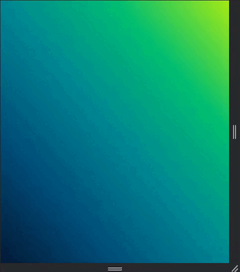

# Card form 📈

## Fill in the form data and watch the changes happen dynamically.

 

### <a href="https://card-form-murex.vercel.app/">Visit the project in Vercel.</a>

 

This project was created based on the <a href="https://www.youtube.com/watch?v=G7_VTWnWz40&t=2s">youtube video</a>.

📈

 

### In this work I was able to practice:

* HTML5
* CSS3
* JavaScript

This project is responsive.

 

